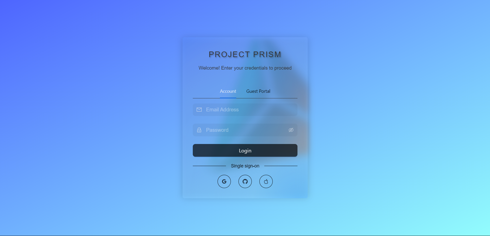
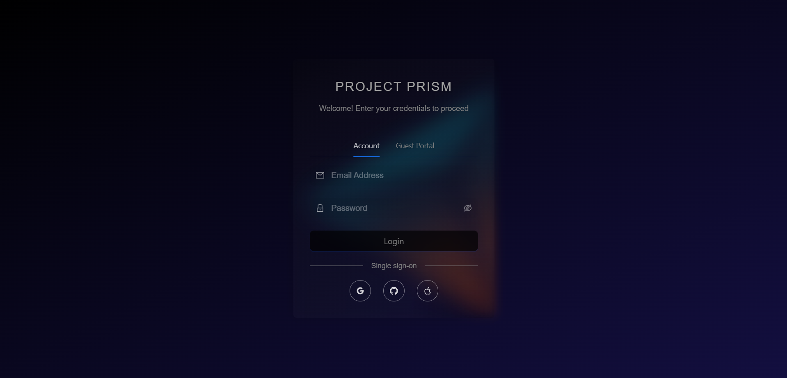

# Project Prism Login Page

A standalone login page built with Bun, Vite, React, Ant Design, and Firebase.  It supports NGINX and other reverse proxy.

## Visual Previews

**Light Theme**


**Dark Theme**

## Technologies Used

*   **Bun:** A fast all-in-one JavaScript runtime ([https://bun.sh/](https://bun.sh/))
*   **Vite:** A lightning-fast build tool for modern web apps ([https://vitejs.dev/](https://vitejs.dev/))
*   **React:** A JavaScript library for building user interfaces ([https://reactjs.org/](https://reactjs.org/))
*   **Ant Design:** A UI component library for React ([https://ant.design/](https://ant.design/))
*   **Firebase:** A Backend-as-a-Service (BaaS) platform by Google for authentication and other backend features ([https://firebase.google.com/](https://firebase.google.com/))

## Getting Started

### Prerequisites

*   Node.js and npm (or Bun)
*   A Firebase project set up with Authentication enabled.

### Installation

1.  Clone this repository:
    ```bash
    git clone https://github.com/EphemeralSapient/login-prism
    ```

2.  Navigate to the project directory:
    ```bash
    cd login-prism
    ```

3.  Install dependencies:
    ```bash
    npm install  # Or use Bun: bun install
    ```

### Configuration 

1.  Create a `.env` file in the project root based on the `example_env.txt` template. 
2.  Replace placeholders in the `.env` file with your actual Firebase project configuration values.
3.  Change base address on `vite.config.ts` to your domain address.

## Deployment

1.  Create a production build:
    ```bash
    vite build  # Or use Bun: bunx --bun vite build
    ```  

 2.  Deploy the contents of the `dist` (or your configured output) folder to your chosen hosting platform.


## License

*   This project is licensed under the Creative Commons Attribution-NonCommercial 4.0 International License. To view a copy of this license, visit [https://creativecommons.org/licenses/by-nc/4.0/](https://creativecommons.org/licenses/by-nc/4.0/).


